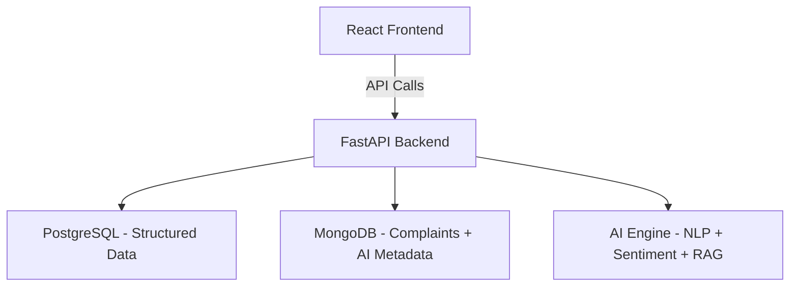

# Naarad-GRS 🔥

AI-Powered Citizen Grievance Redressal System

## 📌 Problem Statement
In many public grievance systems across India, including state helplines and municipal portals, citizen complaints are handled through largely manual workflows. Thousands of complaints are submitted daily, ranging from minor civic inconveniences to urgent issues requiring immediate intervention.

However, existing systems face several critical challenges:

1️⃣ Lack of Intelligent Prioritization.
2️⃣ Manual Classification & Routing.
3️⃣ No Sentiment or Severity Analysis.
4️⃣ Limited Transparency & Tracking.
5️⃣ Scalability Issues.

## 💡 Solution
Naarad-GRS is an AI-powered grievance redressal system designed to make public complaint handling faster, transparent, and inclusive.

🧠 Intelligent Complaint Processing.
🌐 Multilingual & Voice Accessibility.
🔎 Real-Time Tracking & Transparency.
🔐 Privacy & Anonymity.
📊 Smart Administrative Dashboard.

By combining AI automation, multilingual support, and transparent tracking, Naarad-GRS transforms traditional grievance systems into a scalable, efficient, and citizen-centric platform.

## 🧠 Features
🧠 AI-Based Complaint Classification – Automatically categorizes grievances by department using NLP.
⚡ Sentiment & Urgency Detection – Prioritizes critical complaints based on emotional tone and severity.
🌐 Multilingual Support – Accepts grievances in major regional languages to ensure inclusivity.
🎙 Voice-to-Text & Text-to-Voice – Enables speech-based complaint submission and audio responses.
🔄 Intelligent Auto-Routing – Instantly forwards complaints to the appropriate authority.
🆔 Step-by-Step Tracking – Real-time status updates with unique grievance ID.
🔐 Anonymous Submission Option – Protects identity for sensitive complaints.
📊 Admin Analytics Dashboard – Provides insights on complaint trends, resolution time, and satisfaction.
⭐ Feedback & Rating System – Collects post-resolution feedback for continuous improvement.
🎨 Clean & User-Friendly Interface – Simple, accessible design for all citizens.

Perfect 🔥
Here’s a clean, professional **Tech Stack section** ready to paste into your README:

---

# 🛠 Tech Stack

## 🎨 Frontend

* **React.js** – Component-based UI development
* **Tailwind CSS** – Modern, responsive styling
* **Axios** – API communication
* **React Router** – Client-side routing

---

## ⚙ Backend

* **FastAPI (Python)** – High-performance API framework
* **Uvicorn** – ASGI server
* **Pydantic** – Data validation
* **SQLAlchemy** – ORM for structured database management

---

## 🗄 Database

* **PostgreSQL** – Structured relational data (users, departments, tracking, feedback)
* **MongoDB** – Flexible storage for complaints, multilingual content, and AI-processed data

---

## 🧠 AI & NLP

* **HuggingFace Transformers** – Text classification & sentiment analysis
* **Scikit-learn** – ML-based prioritization
* **Whisper (ASR)** – Voice-to-text conversion
* **FAISS** – Vector search for RAG-based retrieval

---

## 🔐 Authentication & Security

* **JWT Authentication** – Secure user sessions
* **Role-Based Access Control (RBAC)** – Citizen / Authority / Admin roles

---

## 🚀 Deployment & DevOps

* **Docker** – Containerization
* **Vercel** – Frontend deployment
* **Render / Railway** – Backend hosting

---

## 🏗 System Architecture

## 👥 Team: Ascendrix
